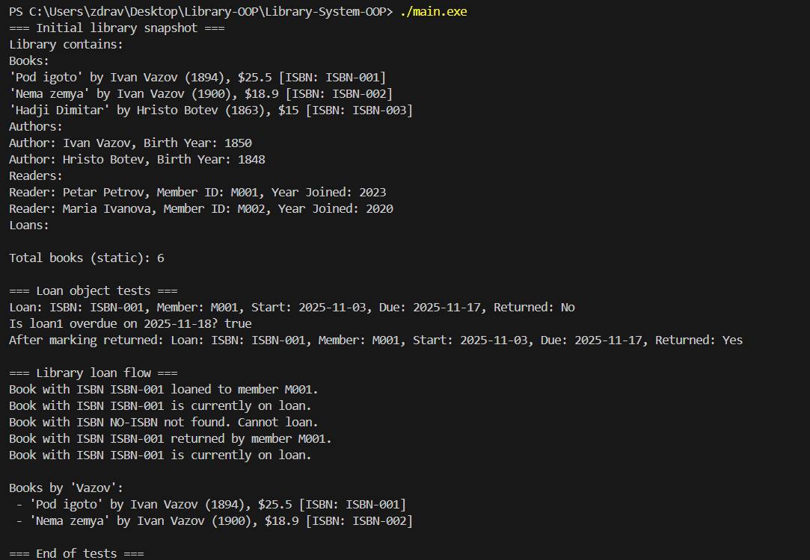

**Проект: Библиотека (Library System)**
**Проект: Библиотека (Library System)**

**Кратко описание**

Това е малка C++ система за управление на библиотека — моделира се работа с книги, автори, членове и заеми. Кодът съдържа класове за `Author`, `Book`, `Reader`, `Loan` и `Library`, както и примерен `main.cpp`, който демонстрира техните взаимодействия.

Проектът илюстрира следните ООП теми: конструктори и деструктори, copy/move семантика, статични членове, валидация на данни и използване на STL контейнери.

**Структура на проекта**

Файлове в репото:

```
Author.h
Book.h
Member.h
Loan.h
Library.h
main.cpp
main.exe (генериран)
Screenshot.png
```

**Компилация и изпълнение**

Компилирайте от папката на проекта с g++ (ако нямате `main.exe`):

```powershell
g++ -std=c++17 -Wall -Wextra -O2 main.cpp -o main.exe
```

След това стартирайте в PowerShell:

```powershell
.\main.exe
```

**Примерен изход (от изпълнение в Windows)**

```
=== Initial library snapshot ===
Library contains:
Books:
'Pod igoto' by Ivan Vazov (1894), $25.5 [ISBN: ISBN-001]
'Nema zemya' by Ivan Vazov (1900), $18.9 [ISBN: ISBN-002]
'Hadji Dimitar' by Hristo Botev (1863), $15 [ISBN: ISBN-003]
Authors:
Author: Ivan Vazov, Birth Year: 1850
Author: Hristo Botev, Birth Year: 1848
Members:
Member: Petar Petrov, Member ID: M001, Year Joined: 2023
Member: Maria Ivanova, Member ID: M002, Year Joined: 2020
Loans:

Total books (static): 6

=== Loan object tests ===
Loan: ISBN: ISBN-001, Member: M001, Start: 2025-11-03, Due: 2025-11-17, Returned: No
Is loan1 overdue on 2025-11-18? true
After marking returned: Loan: ISBN: ISBN-001, Member: M001, Start: 2025-11-03, Due: 2025-11-17, Returned: Yes

=== Library loan flow ===
Book with ISBN ISBN-001 loaned to member M001.
Book with ISBN ISBN-001 is currently on loan.
Book with ISBN NO-ISBN not found. Cannot loan.
Book with ISBN ISBN-001 returned by member M001.
Book with ISBN ISBN-001 is currently on loan.

Books by 'Vazov':
 - 'Pod igoto' by Ivan Vazov (1894), $25.5 [ISBN: ISBN-001]
 - 'Nema zemya' by Ivan Vazov (1900), $18.9 [ISBN: ISBN-002]

=== End of tests ===
```

**Екранна снимка**



**Описание на класовете (по кода)**

1) `Author` (`Author.h`)
- Членове: `std::string name`, `int birthYear`.
- Конструктори: default и параметризиран (`Author(string, int)`).
- Методи: `to_string() const`, getters/setters. Setter за година прави проверка (1850–2025) и отчита невалидни стойности чрез `cerr`.

2) `Member` (`Member.h`)
- Членове: `std::string name`, `std::string memberID`, `int yearJoined`.
- Конструктори: default и параметризиран (използва `std::move`).
- Методи: `to_string() const`, getters и сетъри с валидация (година 1900–2025, непразен `memberID`).

3) `Book` (`Book.h`)
- Членове: `std::string title`, `Author author`, `int year`, `double price`, `std::string isbn`, `inline static int totalBooks`.
- Конструктори: default, параметризиран (използва `std::move`), copy и move конструктори и оператори за присвояване.
- Деструктор намалява `totalBooks`.
- Методи: `setPrice(double)` (валидация), `setYear(int)`, `to_string() const`, `static getTotalBooks()`.

4) `Loan` (`Loan.h`)
- Членове: `isbn`, `memberId`, `startDate`, `dueDate`, `returned`.
- Конструктор проверява дали `dueDate < startDate` и при нужда коригира `dueDate` (и извежда предупреждение).
- Методи: `markReturned()`, `isOverdue(const string& today) const`, `to_string() const`.

5) `Library` (`Library.h`)
- Членове: `std::vector<Book> books`, `std::vector<Author> authors`, `std::vector<Loan> loans`, `std::vector<Member> members`.
- Методи: `addBook`, `addAuthor`, `addMember`, `addLoan`, `hasBook(const string& isbn) const` (търси ISBN чрез `to_string()`), `isBookAvailable(const string& isbn) const` (проверява текущите заеми), `loanBook(...)` (добавя `Loan`), `returnBook(...)` (маркира връщането), `findBooksByAuthor(const string&)` (търси в `to_string()` на книгите), `to_string() const` (редовно резюме на библиотеката).

**Образователни цели и бележки**
- Демонстрира използване на default/параметрични, copy и move конструктори и оператори за присвояване.
- Използване на `inline static` член (`totalBooks`) за проследяване на броя на създадените обекти.
- Работа с STL контейнери (`std::vector`) и `std::move` за оптимизация при присвояване.
- Простичка валидация на входни данни и съобщения за грешки чрез `cerr`.

Бележка за `totalBooks`: В текущата имплементация `totalBooks` се увеличава при всяко създаване (включително копиране), а се намалява в деструктора. Когато обекти се добавят в контейнери (като `vector`), това може да доведе до неочаквано висока стойност на `totalBooks` поради копия/премествания.

**Как да разширите проекта**
- Добавете `.cpp` файлове за имплементации вместо дефиниции в header-ите, ако искате по-голям проект и по-бързо компилиране.
- Заменете търсенето по ISBN чрез `to_string()` с отделен getter за `isbn` в `Book` и използвайте директно сравнение.
- Добавете сериализация (запис/четене от файл) за персистентност на библиотеката.

**Автор**

Име: Martin Jordanov
Номер: 22321
Курс: Обектно-ориентирано програмиране (C++)
Дата: 02.12.2025
